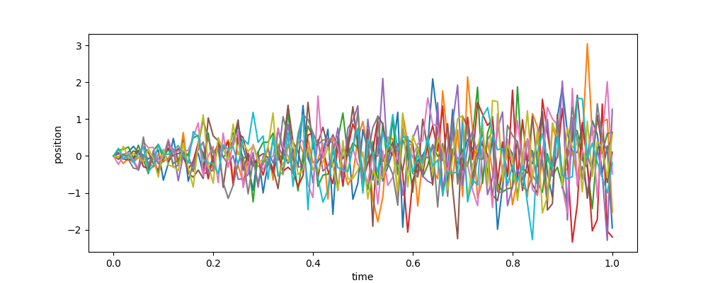

# lab_stat_modelling_2
Самостійна робота №2 із статестичного моделювання

1) Моделювання пуассонівського випадкового процесу
- файл poisson.py

2) Моделювання вінерівського випадкового процесу
- файл wiener.py

3) Моделювання ланцюгів Маркова
- файл markov.py
